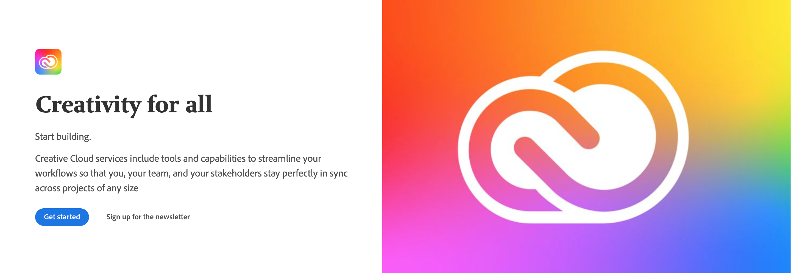

# Adobe I/O Theme

The Adobe I/O Theme powers all the Adobe `developer.adobe.com` sites to ensure that content is consistent across all the sites.

## Prerequisites

This project uses Yarn 3 to manage package dependencies. If you do not have Yarn 3 installed, follow these instructions:

1. Install [Node.js LTS](https://nodejs.org/en/download/). At the time of writing, the latest LTS version is `v16.15.1`.
2. Install Yarn 3 by running the following command:

   ```bash
   corepack enable
   ```

Corepack is a binary shipped with all Node.js releases starting from 16.10.

3. Update Yarn to the latest version by running the following command:

   ```bash
   yarn set version stable
   ```

4. Make sure you are now using version 3.2.1 of Yarn:.

   ```bash
   yarn --version
   ```

That's it. For more information on Yarn 3 usage, see [Yarn usage](https://yarnpkg.com/getting-started/usage).

## Theme usage

[Gatsby Themes](https://www.gatsbyjs.com/docs/themes/what-are-gatsby-themes/) allow site functionality to be packaged as a standalone product for others to easily reuse.
Using a theme, all of your default configuration lives in an npm package.

**View the site templates using the Adobe I/O Theme:**

<details>
  <summary>Documentation template</summary>
  <ul>
    <li><a href="https://adobedocs.github.io/dev-site-documentation-template/">Demo</a></li>
    <li><a href="https://github.com/adobedocs/dev-site-documentation-template/">Repository</a></li>
  </ul>
</details>

## Contents

- [Adobe I/O Theme](#adobe-io-theme)
  - [Prerequisites](#prerequisites)
  - [Theme usage](#theme-usage)
  - [Contents](#contents)
  - [Getting started](#getting-started)
    - [Using GitHub repository templates](#using-github-repository-templates)
    - [Using the Adobe I/O CLI](#using-the-adobe-io-cli)
  - [Content structure](#content-structure)
    - [Frontmatter](#frontmatter)
      - [Edition keyword](#edition-keyword)
      - [Contributor name and link keywords](#contributor-name-and-link-keywords)
    - [Markdown pages](#markdown-pages)
    - [Links](#links)
      - [Anchor links for headings](#anchor-links-for-headings)
      - [Internal links](#internal-links)
      - [External links](#external-links)
    - [Assets](#assets)
  - [Configuration](#configuration)
    - [Environment variables](#environment-variables)
      - [GitHub Contributors](#github-contributors)
      - [Analytics and Feedback component](#analytics-and-feedback-component)
      - [Identity Management Services](#identity-management-services)
    - [Algolia local search testing](#algolia-local-search-testing)
  - [Global Navigation](#global-navigation)
  - [Menus](#menus)
  - [Home link](#home-link)
  - [Side Navigation](#side-navigation)
    - [Variations](#variations)
      - [Single-level side navigation](#single-level-side-navigation)
      - [Single-level side navigation with headers](#single-level-side-navigation-with-headers)
      - [Multi-level side navigation](#multi-level-side-navigation)
      - [Auto-collapsing of multi-level side navigation](#auto-collapsing-of-multi-level-side-navigation)
      - [Use descriptive titles](#use-descriptive-titles)
      - [Be concise](#be-concise)
      - [Use sentence case](#use-sentence-case)
      - [Use the right variation](#use-the-right-variation)
      - [Avoid deep nested menus](#avoid-deep-nested-menus)
      - [Use consistent multi-level behavior](#use-consistent-multi-level-behavior)
  - [Versions](#versions)
  - [Building the site](#building-the-site)
    - [Adding a Path Prefix](#adding-a-path-prefix)
  - [Deploying the site](#deploying-the-site)
    - [Preview on GitHub Pages](#preview-on-github-pages)
    - [Deploy to Azure Storage Static Websites](#deploy-to-azure-storage-static-websites)
  - [Writing Enhanced Markdown](#writing-enhanced-markdown)
    - [Metadata with Front matter](#metadata-with-front-matter)
    - [OpenAPI](#openapi)
    - [JSDoc](#jsdoc)
    - [MDX](#mdx)
    - [Modular Content System](#modular-content-system)
    - [JSX Blocks](#jsx-blocks)
    - [Hero Block](#hero-block)
    - [Resources Block](#resources-block)
    - [Discover Block](#discover-block)
    - [Code Block](#code-block)
      - [Request](#request)
      - [Request](#request-1)
      - [Response](#response)
    - [InlineAlert block (Updated: 2022-06-08)](#inlinealert-block-updated-2022-06-08)
      - [Anatomy of an InlineAlert block](#anatomy-of-an-inlinealert-block)
      - [Simple InlineAlert](#simple-inlinealert)
      - [Richer InlineAlert](#richer-inlinealert)
    - [Media Block](#media-block)
    - [Announcement Block](#announcement-block)
    - [Summary Block](#summary-block)
    - [Title Block](#title-block)
    - [Text Block](#text-block)
    - [Tabs Block](#tabs-block)
    - [Product Card](#product-card)
    - [Product Card Grid](#product-card-grid)
    - [Resource Card](#resource-card)
    - [Carousel](#carousel)
    - [Edition](#edition)
    - [Embedding markdown documents and filtering content](#embedding-markdown-documents-and-filtering-content)
      - [Embedding local markdown files](#embedding-local-markdown-files)
      - [Embedding external markdown files](#embedding-external-markdown-files)
      - [Filtering content with Variant Blocks](#filtering-content-with-variant-blocks)
  - [Customizations](#customizations)
    - [Custom layout](#custom-layout)
    - [Frame](#frame)
    - [Theming](#theming)
  - [Upgrading](#upgrading)
    - [Locally](#locally)
    - [Automated](#automated)
  - [Issue tracker](#issue-tracker)
  - [Contributing](#contributing)
  - [Releases](#releases)

## Getting started

This section will help you get started building a site with the Adobe I/O Theme.

### Using GitHub repository templates

To initialize a site repository, you can use one of the available site templates mentioned above.
Simply click on the “Use this template” button to create a new GitHub repository of the template.

_The templates are pre-configured with example pages._

### Using the Adobe theme I/O 

First make sure the dependency of the theme-aio is added to the project's package.json.

```bash
"dependencies": {
    "@adobe/gatsby-theme-aio": "^4.7.11",
    "gatsby": "4.22.0"
}
```

Then do a yarn install.

```bash
yarn install
```

For running the Adobe theme I/O example or run your repo locally

```bash
yarn dev
```

Doing a full clean up on your local repo

```bash
yarn clean && yarn cache clean && rm -r node_modules && rm yarn.lock
```

### Developing with Adobe Theme I/O

This is what you can do to develop and test locally with an updated aio-theme. Make all your changes in aio-theme. 
Change your directory to /packages/gatsby-theme-aio

```bash
cd /packages/gatsby-theme-aio
````

Publish the current state of the theme package to your yalc directory.  

````bash
yalc publish --push
````

Switch to the project that you would like to test your latest theme-aio with.  Navigate to the root directly of that local project(eg. document-services - you would navigate to document-services repo's root . 

````bash
yalc add @adobe/gatsby-theme-aio
````

View the package.json dependency of the local project to make sure it has added the theme like this.  Also make sure it is using gatsby version 4.22.0.

````bash
  "dependencies": {
    "@adobe/gatsby-theme-aio": "file:.yalc/@adobe/gatsby-theme-aio",
    "gatsby" : "4.22.0"
   }
````

Clean the project and run again

```bash
yarn clean && yarn cache clean && rm node_modules && rm yarn.lock
````

```bash
yarn dev
````

## Content structure

The content of the site is written in [Markdown](https://daringfireball.net/projects/markdown/) which is both easy to read and easy to learn.

As in most cases, the markdown content is stored in GitHub, we support [GitHub Flavored Markdown (GFM)](https://help.github.com/categories/writing-on-github/), which provides additional functionality for common formatting needs.
Additionally, Adobe extended Markdown in a few ways to support certain features see [Writing Enhanced Markdown](#writing-enhanced-markdown).

### Frontmatter

Frontmatter is metadata — at the top of a markdown file — that looks like this:

```yaml
---
title: FAQ—Frequently Asked Questions
description: The FAQ page provides answers to common questions about the configuration and usage of Adobe Analytics in your site.
keywords:
  - Creative Cloud
  - API Documentation
  - UXP
edition: ee
contributor_name: Kalpesh Mehta from Corra
contributor_link: https://partners.magento.com/portal/details/partner/id/70/
layout: none
---
# First heading
```

The `key:value` entries shown in the preceeding example provide your topic with features that include:

- Edition-specific pages for products (such as Commerce vs Open Source)
- Contributor attributions for partners and community members (contributor_name, contributor_link)
- Better search results (title, description, keywords)
- Customizable layouts for pages
- Topic maintainer names and links, and more.

More keywords and value options can be added in future versions as needed.

#### Edition keyword

Adding an `edition` keyword to the frontmatter adds a badge to the top of the page, indicating that the page applies to that product edition. Current values for the `edition` keyword are:

- `ee`: Adobe Commerce only
- `b2b`: B2B feature
- `pwa`: PWA Studio only

For example, adding the `edition` keyword to the frontmatter generates a badge above the page title, as shown here using the `ee` value:


#### Contributor name and link keywords

Adding `contributor_name` and `contributor_link` keywords adds a badge to the top of the page, indicating the partner agency or community contributor name with a link to their business or GitHub profile.

For example, adding the `contributor_name` and `contributor_link` keywords to the frontmatter adds an additional badge above the page title:


### Markdown pages

Make sure the markdown content is located under `src/pages`.

It is recommended to use a folder structure to define your site pages e.g. :

```
root
├- src/pages [/]
│  ├- index.md
│  ├- hero.png
│  ├- api [/api/]
│  │  └- index.md
│  └- guides [/guides/]
│      ├─ index.md
│      └- get_started [/guides/get_started/]
│        ├- index.md
│        └- debugging [/guides/get_started/debugging/]
│           └- index.md
├- .env
├─ gatsby-config.js
└─ package.json
```

Using a folder structure with only `index.md` files gets you close to the final site build files. During the build process, `md` files will be transformed into `index.html` files.
The build files can be found in the `public` folder. Please read the [Overview of the Build Process](https://www.gatsbyjs.com/docs/overview-of-the-gatsby-build-process/) for more information.

Here's a simple example of a content structure with `md` files and the resulting `html` files:

```
root
├- src/pages [/]
│  ├- index.md
│  ├- i_follow_recommendation [/i_follow_recommendation/]
│  │  └- index.md
│  └- i_dont_follow_recommendation.md [/i_dont_follow_recommendation/]
├- .env
├─ gatsby-config.js
└─ package.json
```

will output:

```
root
└- public
   ├- index.html
   ├- i_follow_recommendation
   │  └- index.html
   ├- i_dont_follow_recommendation
   │  └- index.html
   └- Minified JS, CSS files
```

You can exclude pages from the build by either moving them out of `src/pages` or by prefixing the filename with `_`.

### Links

#### Anchor links for headings

By default, the theme automatically generates an anchor link for headings h2 – h6, using the kabab-case (lowercase words separated by hyphens).
For example, if the heading name is **Inline code example**, the theme creates the following anchor link: `#inline-code-example`.

You can customize the anchor link for a heading using the following syntax:

```markdown
## Inline code example {#myCustomAnchorLink}
```

This will override the auto-link behavior and create a custom anchor link. Your custom anchor link can be any case format you want, as long as you don't use any spaces.

#### Internal links

Using markdown links to link to pages e.g. :

_Relative link_

```
[Link to mypage](../mypage.md)
```

_Absolute link_

```
[Link to mypage](/src/pages/mypage.md)
```

Add the suffix `#` to a link to jump to a section of the page for example if your page has a heading named `Join the future`, you can link to it:

```
[Link to mypage](../mypage.md#join-the-future)
```

You can also use absolute links or relative links to link between markdown pages e.g. with the example folder structure from [Content Structure](#content-structure) you can add a link from `/guides/index.md` to `/api/index.md` with:

_Relative link_

```
[Link to API](../api/)
```

_Absolute link_

```
[Link to API](/api/)
```

**Please note that currently only absolute links will work with transcluded content.**

#### External links

External links will automatically open in a new tab or window.

```
[Link to example.com](https://example.com)
```

You can prevent this behavior by adding the search parameter `?aio_internal` to the link.

### Assets

Images can be placed next to markdown pages inside `src/pages` and referenced using relative links. In this case, they'll be optimized during the build process and resulting file names are hashed to resolve potential caching issues.

Other asset types (e.g. PDFs etc.) can be placed inside a `static` folder at the root. Those assets are not being processed but simply copied into the `public` folder.

Here's a simple example of a content structure with a markdown page file and 2 different asset types:

```
root
├- src/pages [/]
│  ├- index.md
│  └- image.png
├- static [/]
│  └- document.pdf
├─ gatsby-config.js
└─ package.json
```

where `image.png` is referenced in `index.md` as an image:

```

```

and `document.pdf` is referenced in `index.md` as a link:

```
[document](/document.pdf)
```

You'll find more information about the `static` folder at [Using the Static Folder](https://www.gatsbyjs.com/docs/how-to/images-and-media/static-folder/).

Please find guidance on ideal illustration sizes in this [document](docs/documents/MCS_Media_+_Image_Recommendations.pdf).

## Configuration

To make sure you don't run into troubles during the site build process, please follow the below configuration steps.

### Environment variables

Follow these steps to configure your `.env` file.

1. Copy `.env.example` to `.env`
2. Add the appropriate values in the `.env` file

**The .env should not be committed.**

#### GitHub Contributors

GitHub's API is being called during the site build phase to retrieve the authors of every markdown page under `src/pages`.
If the GitHub Token information is missing, the build will just print a warning, and no contributor information will be retrieved (just the contributor information in a page's front matter, if any, will be used).

To retrieve your GitHub personal access token, you can follow these [steps](https://docs.github.com/en/github/authenticating-to-github/creating-a-personal-access-token).
Only `READ` permissions on repositories are required for the token.
For example, if your doc site repo was at <https://github.com/adobe/aio-theme> using the `main` branch, this would be what your `.env` would look like:

```properties
REPO_GITHUB_TOKEN=YOUR_PERSONAL_ACCESS_TOKEN_HERE
REPO_OWNER=adobe
REPO_NAME=aio-theme
REPO_BRANCH=main
REPO_ROOT=example
```

By default, you can omit the `REPO_ROOT` env var, and it should use the root folder as the source of the documentation pages. If your site is in a sub-folder, add the relative path as the `REPO_ROOT`.

#### Analytics and Feedback component

The `GATSBY_ADOBE_LAUNCH_SRC=` env var is used to enable the Analytics and Feedback component. To add analytics to your site, you need to set up [Adobe Launch](https://launch.adobe.com), with an Adobe Analytics Reporting Suite. Use the following steps:

**In Adobe Analytics:**

1. Within Adobe Analytics, add a custom eVar (Text String type) to capture the feedback. This eVar will contain either `yes` or `no`.

**In Adobe Launch:**

2. Create two Data Elements:
   - **Feedback-Yes**: `Edit` the code and paste in `return document.querySelectorAll('button.feedback-yes')[0].innerText`
   - **Feedback-No**: `Edit` the code and paste in `return document.querySelectorAll('button.feedback-no')[0].innerText`
3. Make sure the following checkboxes are checked:
   - Enable Default Value
   - Force lowercase value
   - Clean text
4. Create these three Rules:
   - **Feedback-Yes**: On click, it will set variables in Adobe Analytics (set the custom eVar to value of the Feedback-Yes Data Element), and then Send the Beacon.
   - **Feedback-No**: On click, it will set variables in Adobe Analytics (set the custom eVar to the value of the Feedback-No Data Element), and then Send the Beacon.

**In Adobe Analytics:**

  5. On library loaded (page top), Send the Beacon

**In Adobe Launch:**

  6. Go through the `Publishing Flow`, don't forget to `Add All Resources`.
  7. In `Environments`, select the appropriate environment, and under the `Install` column, select the icon.
  8. Copy the URL displayed in the `script` tag.
  9. Add the URL to the `.env` file as the value for `GATSBY_ADOBE_LAUNCH_SRC=`.

**Example:**

```properties
GATSBY_ADOBE_LAUNCH_SRC=https://your.adobe.launch.url.here
```

#### Identity Management Services

To enable IMS on the browser side, you'll need to set the following `.env` variables:

- `GATSBY_IMS_CONFIG` - Map of `client_id` and `scopes` etc.
- `GATSBY_IMS_SRC` - URL source of IMS library

### Algolia local search testing

Sites hosted on the `developer.adobe.com` domain use Algolia search when staged or published to production.

To test your site's search locally — when you build it from your computer using `yarn dev` — you'll need to add Algolia search keys to the following `.env` variables:

```properties
GATSBY_ALGOLIA_INDEX_NAME=your-sites-repo-name
GATSBY_ALGOLIA_APPLICATION_ID=adobes-application-key
GATSBY_ALGOLIA_SEARCH_API_KEY=adobes-public-search-key
```

Please content the Adobe DevSite team to get the correct values for your site.

- `GATSBY_ALGOLIA_INDEX_NAME` — your-sites-repo-name (by convention, the repo and index names are the same).
- `GATSBY_ALGOLIA_APPLICATION_ID` — Alpha-numeric string required to **access** Adobe's product documentation, including yours.
- `GATSBY_ALGOLIA_SEARCH_KEY` - Alpha-numeric string required to **search** Adobe's product documentation, including yours.

## Global Navigation

The Global navigation links are configurable in `gatsby-config.js` under `pages`.
If you follow the recommended [content structure](#content-structure), you can define the `path` value using the folder names.

For example, the following folder structure maps to the URL defined in brackets:

```yaml
src/pages [/]
├- index.md
├- api [/api/]
│  └- index.md
└- guides [/guides/]
   └─ index.md
```

then define your Global Navigation using `pages` in `gatsby-config.js`:

```js
pages: [
  {
    title: 'Adobe Analytics',
    path: '/'
  },
  {
    title: 'Guides',
    path: '/guides/'
  },
  {
    title: 'API Reference',
    path: '/api/'
  }
]
```

You can also define it by pointing to the markdown files:

```js
pages: [
  {
    title: 'Adobe Analytics',
    path: 'index.md'
  },
  {
    title: 'Guides',
    path: 'guides.md'
  },
  {
    title: 'API Reference',
    path: 'api.md'
  }
]
```

Search `?foo=bar` and hash `#foo` values are also supported.

The order in which the pages are defined is respected in the Global Navigation.

If the current location corresponds to a `path` defined under `pages`, the correspond tab in the Global Navigation is set as active.
Otherwise, the first defined tab is set as active by default.

**At least one defined page is required. It's recommended to define the first page `path` as the root path `/`.**

## Menus

You can group links inside a dropdown menu in the Global Navigation with the `menu` field.
Optionally, you can set a description to better differentiate grouped links e.g. based on the previous example:

```js
pages: [
  {
    title: 'Adobe Analytics',
    path: 'index.md'
  },
  {
    title: 'Guides',
    path: 'guides.md'
  },
  {
    title: 'API Reference',
    menu: [{
      title: 'v2.0'
      description: 'Version 2.0 of API' // optional,
      path: '2.0/api.index'
    }, {
     title: 'v1.4'
     description: 'Version 2.0 of API' // optional,
     path: '1.4/api.index'
   }]
  }
]
```

## Home link

The home link should be used to inform the user about a parent or sibling site external to the current one.
Breadcrumbs will be displayed automatically to help the user understand its current location.

You can define a home link in `gatsby-config.js` for instance:

```js
home: {
  title: 'Photoshop',
  path: 'https://www.adobe.com/products/photoshop.html'
}
```

A default home link is displayed if none provided. If you don't want to display any home link, set `hidden` to `true`:

```js
home: {
  hidden: true
}
```

### Table Image
When inserting image to table, please ensure it has a complete .svg path. 

## Side Navigation

The Side navigation links are configurable in `gatsby-config.js` under `subPages`.
You have to create a directory hierarchy which will be represented literally in the URL so that any sub page `path` starts with a `path` from `pages`.

For example, the following folder structure maps to the URL defined in brackets:

```js
src/pages [/]
├- index.md
├- api [/api/]
│  └- index.md
└- guides [/guides/]
   ├─ index.md
   └- get_started [/guides/get_started/]
      ├- index.md
      └- debugging [/guides/get_started/debugging/]
         └- index.md
```

then define your Side Navigation for `/guides/` using `subPages` in `gatsby-config.js`:

```js
pages: [
  {
    title: 'Adobe Analytics',
    path: '/'
  },
  {
    title: 'Guides',
    path: '/guides/'
  },
  {
    title: 'API Reference',
    path: '/api/'
  }
],
subPages: [
  {
    title: 'Get Started',
    path: '/guides/get_started',
    pages: [
      {
        title: 'Debugging',
        path: '/guides/get_started/debugging/'
      }
    ]
  }
]
```

Similarly to the Global Navigation:

- The order in which the sub pages are defined is respected in the Side Navigation.
- Setting search and hash values in the path is supported
- Linking markdown files is supported

**Important: All sub pages paths have to be children of a top-level navigation path.**

### Variations

There are 3 variations of the Side Navigation:

1. Single-level side navigation
2. Categorical single-level side navigation
3. Multi-level side navigation

Please refer to the section [use the right variation](#use-the-right-variation) to understand which side navigation variation to use.

#### Single-level side navigation

To create a single-level side navigation, you shouldn't specify `pages` for `subPages` for example:


is matching to the following config:

```js
pages: [
  {
    title: 'Support',
    path: '/support/'
  }
],
subPages: [
  {
    title: 'Help',
    path: '/support/'
  },
  {
    title: 'How to contribute',
    path: '/support/contribute/'
  },
  {
    title: 'FAQ',
    path: '/support/FAQ/'
  },
  {
    title: 'Community',
    path: '/support/community/'
  }
]
```

#### Single-level side navigation with headers

To create a single-level side navigation with headers, you should set `header: true` on top-level `subPages` and follow the [auto-collapsing](#auto-collapsing-of-multi-level-side-navigation) rules. Do note if one subpage has header enabled, use header navigation type for all navigation items for example:


is matching the following config:

```js
pages: [
  {
    title: 'Support',
    path: '/support/'
  }
],
subPages: [
  {
    title: 'Overview',
    path: '/support/',
    header: true,
    pages: [
      {
        title: 'Help',
        path: '/support/'
      },
      {
        title: 'FAQ',
        path: '/support/FAQ/'
      },
      {
        title: 'How to contribute',
        path: '/support/contribute/'
      }
    ]
  },
  {
    title: 'Community',
    path: '/support/community/',
    header: true,
    pages: [
      {
        title: 'Information',
        path: '/support/community/'
      }
    ]
  }
]
```

#### Multi-level side navigation

To create a multi-level side navigation, you have to define `pages` for `subPages` for example:


is matching the following config:

```js
pages: [
  {
    title: 'Support',
    path: '/support/'
  }
],
subPages: [
  {
    title: 'Overview',
    path: '/support/',
    pages: [
      {
        title: 'Help',
        path: '/support/'
      },
      {
        title: 'FAQ',
        path: '/support/FAQ/'
      },
      {
        title: 'How to contribute',
        path: '/support/contribute/'
      }
    ]
  },
  {
    title: 'Community',
    path: '/support/community/',
    pages: [
      {
        title: 'Information',
        path: '/support/community/'
      }
    ]
  }
]
```

#### Auto-collapsing of multi-level side navigation

In the previous multi-level side navigation example, if the current location is `/support/`, `Overview` auto-collapses and selects `Help` by default because `Overview` and `Help` paths both matches the current location `/support/`.

It also means that if you don't want the auto-collapsing behavior, you have to define different paths for `subPages` than you defined for `pages` e.g. for the previous example, to avoid auto-collapsing of `Overview`,
you would have to define a different path for `Overview` and `Help`:

```js
pages: [
  {
    title: 'Support',
    path: '/support/'
  }
],
subPages: [
  {
    title: 'Overview',
    path: '/support/overview/',
    pages: [
      {
        title: 'Help',
        path: '/support/overview/help/'
      },
      {
        title: 'FAQ',
        path: '/support/overview/FAQ/'
      },
      {
        title: 'How to contribute',
        path: '/support/overview/contribute/'
      }
    ]
  },
  {
    title: 'Community',
    path: '/support/community/',
    pages: [
      {
        title: 'Information',
        path: '/support/community/'
      }
    ]
  }
]
```

which will render:


#### Use descriptive titles

Navigation should be helpful. Choose titles for navigation items that clearly represent the surfaces where they'll go. Avoid using titles that are arbitrary or un-useful, since this can pose usability issues for your product.

#### Be concise

Along with being descriptive, navigation items should be succinct. Reduce any unnecessary words in order to ensure simplicity. Navigation items should never be so long that they require truncation, except in instances where navigation is user-generated.

#### Use sentence case

Navigation items should be written in sentence case.

#### Use the right variation

Make sure that you are using the right variation for your products’ context and users’ needs. Don’t mix behavior, styles, or variations together in a single navigation menu:

- When navigation is simple, use the single-level side navigation.
- When navigation is simple but categorical, use the single-level side navigation with headers.
- When navigation is expansive, hierarchical, and/or you need progressive disclosure in your menu behavior, use the multi-level side navigation.

#### Avoid deep nested menus

The multi-level side navigation should only go 3 levels deep. More than 3 levels will make the indentation indiscernible, which can become a major usability issue in your product.

#### Use consistent multi-level behavior

If top-level navigation items have a location associated with them, send the user to that location and open the sub-level navigation items. If a top-level navigation item does not have any associated location, only open the sub-level navigation items.

Side navigation can use either of these behaviors, but should never mix behaviors in the same experience.

## Versions

You can specify multiple versions for your site in `gatsby-config.js` under `versions`.
The first entry is the selected version by default.

```js
versions: [
  {
    title: 'v2.0',
    selected: true
  },
  {
    title: 'v1.4',
    path: 'https://github.com/AdobeDocs/analytics-1.4-apis'
  }
],
```

**Important: managing multiple versions inside a single repository is not supported.**

## Building the site

You can generate a production version of the site using following commands:

With the CLI:

```bash
aio doc generate
```

Or run following commands:

- To build and preview a production version of the site: `npm run start`.
- To build and preview a production version of the site with path prefix: `npm run start:prefix`.
- To build and preview a development version of the site with hot reloading: `npm run dev`.

### Adding a Path Prefix

Many applications are hosted at something other than the root (`/`) of their domain.
For example, a blog could live at `example.com/blog/`, or a site could be hosted on GitHub Pages at `example.github.io/my-site/`.

To add a Path Prefix, go to your `gatsby-config.js` file and specify the prefix with:

```js
pathPrefix: process.env.PATH_PREFIX || '/MY_PREFIX/'
```

## Deploying the site

### Preview on GitHub Pages

To enable GitHub Pages, go to your repository settings under the GitHub Pages section, select the `gh-pages` branch as source and press Save. Your site will be available for preview at <https://ORG_NAME.github.io/REPO_NAME>.

On every commit to the `main` branch, the site will be built to GitHub Pages automatically, for you to preview as a development version. This is the default branch for new repos in GitHub.

`GitHub Contributors component`: this will use the GitHub token automatically provided by the GitHub Action to retrieve data

`Feedback component`: no environmental variable should be set since GitHub Pages should only be for development purposes

### Deploy to Azure Storage Static Websites

You can manually trigger the deploy workflow by pressing the **Run workflow** button:

1. Go to your repository actions overview page i.e. <https://github.com/ORG/REPOSITORY/actions>
2. Click on the "Deploy" workflow
3. Press **Run workflow**. You can choose which branch the workflow is run on and specify the deployment type (`dev` for development or/and `prod` for production).

Using the `Clean cache`: typically you won't have to set this to `yes`. The most common scenario of when to use is when you do a deploy and a particular resource isn't updating to the most recent change. eg, a static image is still on the old version. Try setting this to `yes` and redeploy the site.

Using the `Exclude a subfolder from deletion`: folders listed here separated out by commas will exclude them from being overwritten when doing a deploy. This is useful if you have multiple sites deploying to the same path. eg, one repo deploys to `/photoshop/` and another repo deploys to `/photoshop/docs/`. You can set the the repo that deploys to `/photoshop/` option as `Exclude a subfolder from deletion`: `docs`. Then whenever that `/photoshop/` repo deploys, the subfolder `docs` will not get deleted. You can also list out multiple subfolders separated by commas like so: `api, photoshop-api-docs, uxp, another-path` etc.

**Pre-requisites:**

1. Setting your `PATH_PREFIX` as explained [here](#adding-a-path-prefix). This is the sub-folder to deploy this micro-site to.

- For example, if you want to deploy to `https://example.com/foo/bar`, you must set `PATH_PREFIX` to `/foo/bar/`
- For sites deployed to the `root`, use `/` as the `PATH_PREFIX`

2. The person initiating the deploy workflow must have `write` access to the repository.

## Writing Enhanced Markdown

### Metadata with Front matter

Front matter allows an author to specify metadata for a page. For example, you can define the page meta title and description by adding front matter to the beginning of your markdown file:

<pre>
---
title: Guides - Adobe Analytics
description: This is the guides overview page of Adobe Analytics
---
</pre>

In addition to the GitHub contributors of a markdown file, you can specify external contributors with front matter.
They'll show up first before the GitHub contributors.

<pre>
---
contributors:
- https://github.com/simonwex
---
</pre>
  
You can also specify whether or not to hide breadcrumb navigation on pages without a hero at the top.  Pages with a Hero can flag the breadcrumb option on the Hero component if needed.
<pre>
---
title: Guides - Adobe Analytics
description: This is the guides overview page of Adobe Analytics without a breadcrumb
contributors:
  - https://github.com/simonwex
  - https://github.com/davidbenge
hideBreadcrumbNav: false
---
</pre>

### OpenAPI

We use [Redoc](https://github.com/Redocly/redoc) to render OpenAPI specs. Simply use front matter to define the spec URL.

<pre>

## openAPISpec: https://raw.githubusercontent.com/AdobeDocs/analytics-2.0-apis/master/docs/swagger.json

</pre>

### JSDoc

We currently recommend to use the [JSDoc to markdown](https://github.com/jsdoc2md/jsdoc-to-markdown) converter.

Use front matter to specify a JSDoc markdown document.

<pre>

## jsDoc: true

</pre>

Then annotate your JS parameters with `<JsDocParameters/>` to render them nicely see the [example markdown file](https://raw.githubusercontent.com/adobe/aio-theme/main/example/src/pages/jsdoc/index.md).

### MDX

[MDX](https://mdxjs.com/) is supported out of the box. MDX enables writing [JSX React components](https://reactjs.org/docs/introducing-jsx.html) in markdown giving authors new powers.
Despite the markdown files having all an `md` extension, they are actually treated as MDX files. You can use `md` and `mdx` extensions interchangeably.

As we try to limit the use of MDX in favor of pure markdown, we have come up with a way to couple the use of basic markdown syntax with JSX.

**Always make sure to close JSX blocks and use line breaks between JSX blocks and markdown content to avoid MDX parser issues.**

### Modular Content System

The modular content system is a set of content blocks with variants and compositions that can be used to create pages.

- **Content Blocks are goal-focused.** A group of content that has a specific goal or intention, to structure and support the overall narrative.
  _Examples are groupings of text, groupings of buttons, and hero content._

- **Variants are messaging-focused.** The messaging points/content (this includes both written and visual content/images) that makes the goal of the content block happen.
  _Examples are text content blocks with icons vs no icons._

- **Compositions are layout-focused.** The overall narrative for the page.

**A variant can go into a _content block_. Multiple _content blocks_ make up a _composition_.**

### JSX Blocks

**The Content Blocks are defined as JSX Blocks.** They use a `slots` property to identify which markdown elements to ingest using only string properties.
This helps maintain better readability when rendered on <https://github.com>.

Common slots are: `heading`, `image` and `text`. See below examples for full details.

### Hero Block

A Hero Block should be used on every home page. **Only 1 Hero Block per page is allowed**.
They are used to set up the tone of the page and optionally add call to actions and intentions for users.

There are 3 different variants:

- The default variant for Documentation pages.
- The half width variant for Product/Platform authored pages.
- The full width variant for Index home pages.

**Default variant:**


```
<Hero slots="image, heading, text" background="rgb(64, 34, 138)" hideBreadcrumbNav={false}/>


# Adobe Analytics

Adobe Product API offers limitless ways to integrate your most important customer data into key business processes. Adobe Product API offer limitless ways.
```

Use `slots` to identify the markdown content:

- `heading` (required)
- `text` (required)
- `image` (optional)

Use `background` to set a custom background color matching your color scheme. Defaults to `rgb( 29, 125, 238)`;

Use `theme` to match the text color to your color scheme. Defaults to `dark`.

Use `hideBreadcrumbNav` to optionaly hide the breadcrumb navigation on this variant. Defaults to false.

**Half width variant**



```
<Hero slots="image, icon, heading, text1, text2, buttons" variant="halfwidth" />


# Creativity for all

Start building.

Creative Cloud services include tools and capabilities to streamline your workflows so that you, your team, and your stakeholders stay perfectly in sync across projects of any size

* [Get started](https://adobe.io)
* [Sign up for the newsletter](https://adobe.io)
```

Use `variant="halfwidth""` to set the half width variant.

Use `slots` to identify the markdown content:

- `heading` (required)
- `text` (required)
- `image` (required)
- `background` (optional)
- `icon` (optional)
- `buttons` (optional)

**Full width variant**


```
<Hero slots="image, heading, text, buttons" variant="fullwidth" background="rgb(51, 51, 51)" />


# The most memorable digital experiences are unleashed by developer creativity

Adobe products and technologies power them

* [Explore our APIs](https://adobe.io)
* [Subscribe](https://adobe.io)
```

Use `variant="fullwidth""` to set the full width variant.

Use `slots` to identify the markdown content:

- `heading` (required)
- `text` (required)
- `image` (required)
- `background` (optional)
- `buttons` (optional)

Use `theme` to match the text color to your color scheme. Defaults to `dark`.

### Resources Block

Each Documentation overview page has a Resources Block with to display a list of links.
They can point to internal or external documents or pages.

**Only 1 Resource Block per page is allowed**.


```
<Resources slots="heading, links"/>

#### Resources

* [Quickstart Guide](https://www.adobe.io/apis/experiencecloud/analytics/docs.html)
* [Adobe Analytics GitHub Repo](https://github.com/AdobeDocs/analytics-2.0-apis)
```

Use `slots` to identify the markdown content:

- `heading` (required)
- `links` (required)

### Discover Block

A Discover Block is a section of content that can be used to highlight certain areas of a Documentation overview page. There can be multiple Discover Blocks in a row.
Discover Blocks can be illustrated but only one illustration per row is allowed.

**Single Discover Block**


```
<DiscoverBlock width="100%" slots="heading, link, text"/>

### Get Started

[Quickstart Guide](guides/)

Get started with the Adobe Analytics APIs.
```

**Multiple Discover Blocks in a row**


```
<DiscoverBlock slots="heading, link, text"/>

### Guides

[Calculated Metrics API](guides/calculated_metrics_api/)

Returns information on the user's company that is necessary for making other Adobe Analytics API calls.


<DiscoverBlock slots="link, text"/>

[Segments API](guides/segments_api/)

Provides configuration guidance and best practices for the /segments endpoint.


<DiscoverBlock slots="link, text"/>

[Reporting Guide API](guides/reporting_api/)

Provides configuration guidance and best practices for the /reports endpoint.

<DiscoverBlock slots="link, text"/>
```

**Discover Block with illustrations**


```
<DiscoverBlock slots="image, heading, link, text"/>


### Developer forum

[Get started](https://adobe.io)

Open discussion and support with community experts and Adobe staff.

<DiscoverBlock slots="link, text"/>

[Experience league](https://adobe.io)

Tutorials and videos for the community.
```

Use `slots` to identify the markdown content:

- `heading` (1 required per row)
- `text` (required)
- `link` (required)
- `image` (optional)

Use `width` to define the size of the block.

### Code Block

A Code Block is an enhanced code section which supports additional features like request/response format, multiple languages etc.


```
<CodeBlock slots="heading, code" repeat="3" languages="JSON, CURL, JSON" />
```

<pre>
#### Request

```json
{
  "rsid":"adbedocrsid",
  "globalFilters":[
    {
      "type":"dateRange",
      "dateRange":"2017-12-31T00:00:00.000/2018-01-06T23:59:59.999"
    }
  ]
}
```

#### Request

```bash
curl -X POST \
  https://analytics.adobe.io/api/{COMPANYID}/reports \
  -H 'Accept: application/json' \
  -H 'Authorization: Bearer {ACCESSTOKEN}' \
  -H 'Content-Type: application/json' \
  -H 'x-api-key: {APIKEY}' \
  -H 'x-proxy-global-company-id: {COMPANYID}' \
  -d '{REQUESTJSON}'
```

#### Response

```json
{
  "totalPages":1,
  "numberOfElements":7,
  "number":0,
  "totalElements":7
}
```
</pre>

Use `slots` to identify the markdown content:

- `heading` (required)
- `code` (required)

Use `repeat` to define how many code sections are part of the Code Block.

Use `languages` to define a language name for each code section. Code sections with the same heading are automatically
grouped together.

### InlineAlert block (Updated: 2022-06-08)

The Inline Alert block provides ways to highlight various types of information, using an optional title, text blocks,
and variants.

#### Anatomy of an InlineAlert block

```markdown
<InlineAlert variant="[value]" slots="title, text1, text2, text[n]" />
```

**Variant values**

As shown above, the first property of an InlineAlert is the `variant` property. The value of this property determines
the icon and border color of the alert. The `variant` values you can use are described here:

- `info` (default) — use to add helpful information.
- `help` — use to add brief steps from or links to other help topics.
- `error` — use to highlight errors that may result from an action.
- `success` — use to highlight success messages that may be displayed after an action.
- `warning` — use to focus attention on a potential problem that could occur.
- `neutral` — use as an all-purpose callout that displays a black border and no icon.


The slots and variants of an InlineAlert block are as follows.

**Slot values**

Use the following slots to style your markdown text within the InlineAlert block:

- `title` (optional) — Use plain markdown text. The slot will bold the title and space it above your text appropriately.
  You can only use one title per alert block.
- `text` (required). Use plain markdown text.
- `text2`...`text[n]` (optional) - You can use additional text slots to display multiple paragraphs. Just make sure each
  additional text block starts with the word `text` followed by numbers or letters that make each text slot unique.

#### Simple InlineAlert

The simplest `InlineAlert` you can create uses a single `text` slot, as shown here:

```markdown
<InlineAlert slots="text" />

This is the text that displays within the default alert variant — info.
```


#### Richer InlineAlert

To add an InlineAlert with a different variant, a title, and multiple paragraphs, you can specify all the optional
properties, as shown here:

```markdown
<InlineAlert variant="help" slots="header, text1, text2, text3, text4" />

Alternative steps:

**Step 1:** This is faux step text for the `text1` slot.
This is faux step text for the `text1` slot.
This is faux step text for the `text1` slot.
This is faux step text for the `text1` slot.
This is faux step text for the `text1` slot.

**Step 2:** This is faux step text for the `text2` slot.
This is faux step text for the `text2` slot.
This is faux step text for the `text2` slot.

**Step 3:** This is faux step text for the `text3` slot.

**Step 4:** This is faux step text for the `text4` slot.
This is faux step text for the `text3` slot.
```


#### Nested InlineAlert

To add an InlineAlert within another component, we have created a new component to do that. Here is how you should create an inline alert
within another component:

```markdown
<InlineNestedAlert variant="info" header="true" iconPosition="right">

   Personal Information :

   Lorem ipsum dolor sit amee

   Add more information

   Lorem ipsum dolor sit amet

 </InlineNestedAlert>
 ```
 This new InlineNestedAlert will not be supporting the 'slot' parameter as the regular InlineAlert. 
 The nested InlineAlert must wrap around the content that it wants to display.  It can only supports one header by using the parameter 
 header="true".  Header will not be supported if there is only 1 line.  It supports variant the same way as the regular InlineAlert.  Also it supports 
 another parameter as iconPosition to be 
 displayed either left or right side of the alert.
 
### Media Block

The Media Block is used to display interactive medias like videos.


```

<Media slots="video"/>

<https://www.youtube.com/watch?v=mkgpeWbHrjA>

```

Use `slots` to identify the markdown content:

- `video` (required)

### Announcement Block

The Announcement Block goes directly underneath the Hero Block for Product/Platform pages.
It's used to call out new features, blog posts, news etc. anything that needs that needs to be surfaced above the fold.


```

<AnnouncementBlock slots="heading, text, button" />

### Try out the magic of Photoshop

Pull together Photoshop, Lightroom and Adobe Sensei into one place. Reduce time spent in each app, freeing you up for more creative time.

[Demo](https://www.adobe.io/apis/creativecloud/photo-imaging-api/api-demo.html)

```

Use `slots` to identify the markdown content:

- `heading` (required)
- `button` (required)
- `text` (optional)

Use `theme` to match the text color to your color scheme. Defaults to `light`.

Use `className` to customize the component **at your own risk.**

### Summary Block

The Summary Block acts as an anchor at the end of the page. It's a change for Products to give users another call to action, and encourage them to interact after they have gotten to the bottom of the page.


```

<SummaryBlock slots="image, heading, text, buttons" background="rgb(246, 16, 27)" />


## Subscribe to the Creative Cloud developers newsletter

A monthly newsletter featuring news for anyone who creates, develops, or build plugins, extensions, or integrations for the
Creative Cloud family of products.

- [Subscribe to the newsletter](https://adobe.io)
- [Learn more](https://adobe.io)

```

Use `slots` to identify the markdown content:

- `heading` (required)
- `buttons` (1 button required at least)
- `text` (optional)
- `image` (optional)

Use `background` to set a custom background color matching your color scheme.

Use `theme` to match the text color to your color scheme. Defaults to `dark`.

Use `className` to customize the component **at your own risk.**

### Title Block

A Title Block is used at the beginning of sections, or to frame compositions on Product/Platform pages.


```

<TitleBlock slots="heading, text" theme="light" />

### Collaborate better with Content Cloud APIs

With the Cloud Content APIs, you can bring design work created in XD directly to your product or service.

```

Use `slots` to identify the markdown content:

- `heading` (required)
- `text` (optional)

Use `theme` to match the text color to your color scheme. Defaults to `lightest`.

Use `className` to customize the component **at your own risk.**

### Text Block

Text Blocks are used for layout compositions. They are areas for long blocks of text and explaining features etc. for Product/Platform pages.
They are coupled with images or videos.


**With an image, texts and links**

```

<TextBlock slots="image, heading, text1, text2, links" />


### Extend Adobe CC Flagship Apps

Extend Creative Cloud desktop apps like [Photoshop](https://www.adobe.com/products/photoshop.html), [Premiere Pro](https://www.adobe.com/products/premiere.html), and [InDesign](https://www.adobe.com/products/indesign.html) through our APIs and SDKs.
Be sure to check out [Common Extensibility Platform (CEP)](https://www.adobe.io/apis/creativecloud/cep.html), which lets you build custom UI panels for multiple CC apps at once.

When you're ready to ship, distribute your work on [Adobe Exchange](https://exchange.adobe.com/), the preferred marketplace for Adobe Creative Cloud users.
And be sure to join the [Exchange Program for Creative Cloud](https://partners.adobe.com/exchangeprogram/creativecloud) to unlock more benefits, including streamlined publishing and promotional opportunities.

-  [Adobe Premiere Pro](https://www.adobe.com/products/premiere.html)
-  [Adobe InDesign](https://www.adobe.com/products/indesign.html)
-  [Adobe After Effect](https://www.adobe.com/products/aftereffects.html)

```

**Multiple Text Blocks in a row**


```

<TextBlock slots="image, heading, text, links" width="33%" />


### Microsoft teams

Easily share Creative Cloud assets and files, and get comment notifications on your prototypes.

- [Learn more](https://www.microsoft.com/microsoft-365/microsoft-teams/group-chat-software)

<TextBlock slots="image, heading, text, links" width="33%" />


### JIRA Cloud

Make designer to developer handoffs easy. Find the latest designs and specs and get thumbnail previews and asset info.

- [Learn more](https://www.atlassian.com/enterprise/cloud)

<TextBlock slots="image, heading, text, links" width="33%" />


### Slack

Instantly share Creative Cloud files, designs, specs, and notifications all in real time.

- [Learn more](https://slack.com/enterprise)

```

**With a video, icons, buttons dark themed**


```

<TextBlock slots="video, icons, heading, text, buttons" theme="dark" />

[Creative Cloud for a new era](https://www.youtube.com/watch?v=JemJbNJ4ZtU&ab_channel=AdobeCreativeCloud)

- 
- 

### Partner Success Story

Connect your users to Creative Cloud right from within your mobile or web apps with our service APIs. Give users access to
world-class creative assets with the Adobe Stock API, or sign up for early information on our upcoming CC Storage API.

- [Learn more](https://adobe.io)
- [Sign up for partner program](https://adobe.io)

```

Use `slots` to identify the markdown content:

- `heading` (required)
- `text` (required). Support multiple texts e.g `text1, text2` etc.
- `links` (optional). Supports 1 optional image per link.
- `buttons` (optional)
- `icons` (optional)
- `image` (optional). `image` should only be defined as first or last slot to define the layout. `image` excludes `video`.
- `video` (optional). `video` should only be defined as first or last slot to define the layout. `video` excludes `image`.

Use `theme` to match the text color to your color scheme. Defaults to `lightest`.

Use `width` to define the size of the block. Supported values are `100%`, `50%`, `33%` and `25%`;

Use `isCentered` to center the text.

Use `className` to customize the component **at your own risk.**

### Tabs Block

Tabs block is a custom block component that allows for tabbed content that can be displayed either vertically or horizontally.


```

<TabsBlock orientation="vertical" slots="heading, image, content" theme="light" />

### Create PDF from URL


<Overview/>

<TabsBlock orientation="vertical" slots="heading, content" theme="light" />

### Dynamic PDF Document Generation

<Overview/>

```

```

<TabsBlock orientation="horizontal" slots="heading, image, content" theme="light" />

### Create PDF from URL


<Overview/>

<TabsBlock orientation="horizontal" slots="heading, content" theme="light" />

### Dynamic PDF Document Generation

<Overview/>

```

Use `slots` to identify the markdown content:

- `heading` (1 required per row)
- `image` (optional)
- `content` (1 required per row)

Use `theme` to match the text color to your color scheme. Defaults to `light`.

Use `orientation` to tabs can be either horizontal or vertical. Defaults to `horizontal`.

Use `repeat` to define how many tab items sections are part of the tabs Block.

### Product Card

Product Cards group information that allow to browse a collection of related content.


```

<ProductCard slots="icon, heading, text, buttons" theme="light" width="33%" />


#### CC Storage API

CC Storage API lets you access and modify assets stored in the Creative Cloud, the world's most popular creative platform.

- [Learn more](https://adobe.io)
- [View docs](https://adobe.io)

<ProductCard slots="icon, heading, text, buttons" theme="light" width="33%" />


#### Adobe Stock

Gives your users access to the perfect Adobe Stock asset to enhance their creative projects.

- [Learn more](https://adobe.io)
- [View docs](https://adobe.io)

<ProductCard slots="icon, heading, text, buttons" theme="light" width="33%" />


#### Common Extensibility Platform

Build extensions with HTML, CSS, Javascript and Node. Deploy across multiple Adobe apps.

- [Learn more](https://adobe.io)
- [View docs](https://adobe.io)

```

Use `slots` to identify the markdown content:

- `heading` (required)
- `text` (required)
- `buttons` (1 button required at least)
- `icon` (optional)

Use `theme` to match the text color to your color scheme. Defaults to `lightest`.

Use `width` to define the size of the block. Supported values are `100%`, `50%`, `33%` and `25%`;

### Product Card Grid

Use Product Card Grid to display Product Cards with filter and sort options based on meta data.


Set `interaction` to `true` to display the filter and sort options.

See the [data example](https://github.com/adobe/aio-theme/blob/main/example/src/products/index.js) to provide for `clouds` and `products`.

```

<ProductCardGrid clouds={clouds} products={products} interaction={true} />
```

Use `orderBy` to define the default ordering. Choose between `last_updated` and `name`.

Use `filterByCloud` to define the default cloud filter. You can define multiple clouds by default `filterByCloud={[cloud1, cloud2]}`.

Use `filterByIds` to define a custom filter e.g. `filterByIds=[1, 3, 4]` to display products with ids `1`, `3` and `4` in that order.

### Resource Card

Resource Cards are used on Product/Platform pages for external cross-promotion of materials. Examples includes articles, videos etc.

There are 2 variants: horizontal and vertical Resource Cards. Use multiple Resource Cards with different variants to create a Resource composition.


```
<ResourceCard slots="link, image, heading, text" width="33%"/>

[Adobe I/O](https://adobe.io)


### Creating a Great Adobe XD Plugin Listing

Rob Kleiman, July 8th 2020


<ResourceCard slots="link, image, heading, text" width="33%" />

[Adobe I/O](https://adobe.io)


### Pattern Builder: A Behind the Scenes Look at Adobe Capture

Nihil Gupta, July 24th 2020


<ResourceCard slots="link, image, heading, text" width="33%" />

[Adobe I/O](https://adobe.io)


### Photoshop Extensibility Enters a New Era Soon: How to get Involved Early

Ash Ryan Arnwine, March 12th 2020
```

Use `slots` to identify the markdown content:

- `link` (required)
- `heading` (required)
- `image` (required)
- `text` (optional)

Use `theme` to match the text color to your color scheme. Defaults to `lightest`.

Use `width` to define the size of the block. Supported values are `100%`, `50%` and `33%`.

### Carousel

Carousel is used to show the information along with images and buttons.


```
<Carousel slots="image,heading, text, buttons" repeat="2"  theme="light"  />


#### CC Storage API

CC Storage API lets you access and modify assets stored in the Creative Cloud, the world's most popular creative platform.

* [Learn more](../guides)
* [View docs](../guides)


#### CC Storage API

CC Storage API lets you access and modify assets stored in the Creative Cloud, the world's most popular creative platform.

* [Learn more](../guides)
* [View docs](../guides)
```

Use `slots` to identify the markdown content:

- `image` (required)
- `heading` (optional)
- `text` (required)
- `buttons`(optional)

Use `theme` to match the text color to your color scheme. Defaults to `dark`.

Use `repeat` to define how many code sections are part of the carousel.

### VideoCarousel

VideoCarousel is used to show the information along with videos and buttons.


Use `slots` to identify the markdown content:

- `heading` (optional)
- `text` (required)
- `buttons`(optional)

Use `videos` give the imported videos in an array

Use `position` to position the video values are left, right. The preset variant is left.

Use `variant` to specify full width or half width values are fullWidth,halfWidth. By default it is fullWidth.

Use `enableNavigation` to display navigation icon. By default it is in false. If you want naviagtion set it to true

Use `navigationIconColor` to change the icon color. By default it is black.

```
import video1 from './video1.mp4'
import video2 from "./video2.mp4"
import video3 from "./video3.mp4"

<VideoCarousel slots="heading, text, buttons" repeat="3" theme="lightest" videos={[video1,video2,video3]} isCenter position="right" variant = 'fullWidth' enableNavigation="true" navigationIconColor="#1473E6"/>

#### Acrobat on web and desktop 

The Adobe Express full editor allows users to edit images and quickly create eye-catching cover and divider pages within Acrobat.

* [Learn more](../guides)
* [View docs](../guides)

#### Breakout EDU 

Breakout EDU is an educational game platform for teachers and students that enables users to bring more creativity to virtual games with the Adobe Express full editor.

* [Learn more](../guides)
* [View docs](../guides)

### Letter 

Letter is an email newsletter tool that helps content creators, designers, and developers make standout communications with the Adobe Express full editor.

* [Learn more](../guides)
* [View docs](../guides)

```

### TeaserBlock

Teaser component is used to place the text over the background image/color


```
import bgImg from "./Images/black_image.png"
<TeaserBlock  slots="heading,text,button" textColor="white" position="right" bgURL={bgImg}/> 

### TeaserBlock with image background

In TeaserBlock using bgURL={img}, we can load the backroundimage in the div and align the text position on the right by using position="right" attribute

- [Learn more](../guides/)


<TeaserBlock slots="heading,text" textColor="white" position="left" backgroundColor="rgb(64, 34, 138)" />

### TeaserBlock with background color

In TeaserBlock using bgURL={img}, we can load the backroundimage in the div and align the text position on the right by using position="left" attribute

```

Use `slots` to identify the markdown content:

- `heading` (optional)
- `text` (optional)
- `buttons`(optional)

Use `bgURL` to load the image, `backgroundColor` to load the backgroundcolor.

Use `position` to position the heading, text values are `left, right, center`.

Use `textColor` to color the heading, text

Use `variant` to specify full width or half width values are `fullwidth,halfwidth`.

### Accordion 

Accordion has a group of accordion items used to collapse and expand the child content

#### Accordion item

Accordion item is to expand and collapse the content by clicking the icon. By default it uses `+` and `-` icon

Use `isOpen` to expand the content without clicking the icon

Use `header` to display the heading with the icon

Use `isChevronIcon` to use ChevronIcon to expand and collapse instead of the default icon.

Use `position` to position the icon text values are `left, right`. It default to the left

Use `iconColor` to change the icon color. By default it is black


```

<Accordion>

<AccordionItem header="AccordionItemWithDefaultIcon">

AccordionItem with default options to expand and collapse

</AccordionItem>

<AccordionItem header="AccordionItemWithChevron" isChevronIcon  position="right" iconColor="#1473E6">

AccordionItem expand and collapse using ChevronIcon 

</AccordionItem>

<AccordionItem header="AccordionItemDefaultOpen" isOpen>

AccordionItem default expand

</AccordionItem>    

</Accordion>

```

### Edition

The Edition component is used to display the edition of the product.

### Embedding markdown documents and filtering content

You can use MDX transclusion to embed markdown documents into other markdown documents see the [MDX documentation](https://mdxjs.com/getting-started#documents).

#### Embedding local markdown files

For example, if you want to include the content of `overview.md` into `index.md`:

`index.md` content:

```
import Overview from './overview.md'

# Welcome

Lorem ipsum

<Overview/>

## Questions

Lorem ipsum
```

`overview.md` content:

```
## Overview

Lorem ipsum
```

`index.md` will be rendered as:

```
# Welcome

Lorem ipsum

## Overview

Lorem ipsum

## Questions

Lorem ipsum
```

#### Embedding external markdown files

Sites are using `npm` to define dependencies so we can also include external markdown documents.

**You have to define a name in the `package.json` like [here](https://github.com/AdobeDocs/dev-site-documentation-template/blob/main/package.json#L3) to be able to include it
as a dependency in another site.**

You don't have to release the site on npm since npm supports installing dependencies using github repository urls. For example, to install <https://github.com/AdobeDocs/dev-site-documentation-template/>
as a dependency in another site, you can run the command `npm install --save adobedocs/dev-site-documentation-template`;

Your site package will show up under `node_modules/[PACKAGE_NAME]` e.g. `node_modules/dev-site-documentation-template`.

See full example below using a Variant block.

#### Filtering content with Variant Blocks

Together with Variant Blocks, the author can query what should be rendered from external sources.

**This allows to write content once, and reuse it everywhere.**

For example, let's say there are 2 repositories named <http://github.com/adobedocs/repo1> and <http://github.com/adobedocs/repo2>.
Both are sites using the theme and have markdown content defined under `src/pages`.

1. repo1 has reusable markdown content written with Variant Blocks under `/src/pages/debugging/index.md`:

```
## How to Debug Your Plugin

Bugs happen! In this tutorial, you will learn how to debug your plugin.

<Variant product="XD" repeat="2" />

First launch the XD console, by clicking Developer > Console

[XD link](https://adobe.io)

<Variant product="Photoshop" repeat="2" />

First launch the Photoshop console, by clicking Developer > Console

[Photoshop link](https://adobe.io)

<Variant test="image" repeat="2" />

#### Image


```

_Use `repeat` to define how many elements are part of the Variant Block. Use any `key=value` property to mark your Variant Block._

2. repo2 added repo1 as dependency with `npm install --save adobedocs/repo1` to be able to reference its markdown content.

3. repo2 embeds repo1 content by using the `import` statement and inserts the content in its own markdown together with a `query` filter to only display what is needed.

```
import Debugging from 'repo1/src/pages/debugging/index.md'

# Debugging

<Debugging query="product=Photoshop" />

More content
```

will be rendered as:

```
# Debugging

## How to Debug Your Plugin

Bugs happen! In this tutorial, you will learn how to debug your plugin.

First launch the Photoshop console, by clicking Developer > Console

[Photoshop link](https://adobe.io)

More content
```

You can query multiple elements, for example you can add the section with the image by adding it to the `query`.

```
 <Debugging query="product=Photoshop&image=test" />
```

## Customizations

When using themes, you can take advantage of something called [shadowing](https://www.gatsbyjs.com/docs/themes/shadowing/). This allows you to override the default component included in the theme with a custom one you’ve created.

The Adobe I/O Theme package has a component to render code using the [Prism syntax highlighter](https://prismjs.com/).
With shadowing, you can override the component to provide your own.

If you look at the file tree of your site, you’ll see it looks something like this:

```
root
├─ src/pages
│   ├- index.md
│   └- etc.
├- .env
├─ gatsby-config.js
└─ package.json
```

To enable shadowing, you need to add a folder called `@adobe/gatsby-theme-aio`.
Any file placed in that directory with a path that matches the path of a file from the theme will completely shadow the file.

So the new folder structure with shadowing enabled will look like following:

```
root
├─ src
│  ├- pages
│  │  ├- index.md
│  │  └- etc.
│  └- @adobe
│     └- gatsby-theme-aio
│        └- components
│           └- Code
│              └- index.js
├- .env
├─ gatsby-config.js
└─ package.json
```

You can define your own `Code` components under `src/@adobe/gatsby-theme-aio/components/Code/index.js`.

_Notice omitting the `src` directory in the shadow folder._

### Custom layout

You can build pages without the default layout by setting `layout` to `none` within the page front matter.
The Global Header, Footer, Side Navigation etc. are always shown but anything in between can be customized.

See the [example markdown file](https://raw.githubusercontent.com/adobe/aio-theme/main/example/src/pages/no_layout/index.md).

### Frame

This can be useful if you want to embed pages from another system. The embedded page will be framed between the Global Header and Footer.
Simply set `frameSrc` to the `url` of the external page within the front matter.

See the [example parent page](https://raw.githubusercontent.com/adobe/aio-theme/main/example/src/pages/frame.md) and [child page](https://github.com/adobe/aio-theme/blob/main/example/static/child.html) which leverages the [Penpal](https://github.com/Aaronius/penpal)
library to create a communication channel to exchange information.

### Theming

Currently, you can only define a light or dark theme for Code blocks. By default, Code blocks are displayed in `dark` theme.
To change Code blocks from `dark` to `light` theme, you have to shadow the `theme/index.js` file:

```
export default {
  code: 'light'
};
```

## Upgrading

### Locally

To upgrade to the latest version of the theme, simply run `npm update` if you have defined the dependency with a version range selector.
If not, update the version of the dependency by setting the version manually in the `package.json` and run `npm install`.

This will also update the lock file `package-lock.json`.

### Automated

We recommend to setup [GitHub dependabot](https://docs.github.com/en/free-pro-team@latest/github/administering-a-repository/keeping-your-dependencies-updated-automatically) in your site repository.
Simply copy the [dependabot](https://github.com/AdobeDocs/dev-site-documentation-template/blob/main/.github/dependabot.yml) file in your `.github` folder.

The bot will automatically submit pull requests to keep your version of the theme up to date. Please make sure to use a version range selector for your dependencies in your `package.json`.

## Issue tracker

Use the [GitHub issue tracker](https://github.com/adobe/aio-theme/issues) to report issues, ask questions or log feature requests.
Any feedback is welcome !

Please check existing issues before filing anything new.

## Contributing

Contributions are welcomed! Read the [Contributing Guide](./.github/CONTRIBUTING.md) for more information.

See [Conventional Commits](https://conventionalcommits.org/) for commit guidelines.

## Releases

You can check the latest released version of the theme at <https://github.com/adobe/aio-theme/releases>.

This repository is setup as a monorepo using [lerna](https://github.com/lerna/lerna) for automated publishing to NPM.

Use `GH_TOKEN=[YOUR_GH_TOKEN] lerna version --create-release github --conventional-commits --no-private -m "chore(release): publish"` for publishing the theme on npm.
