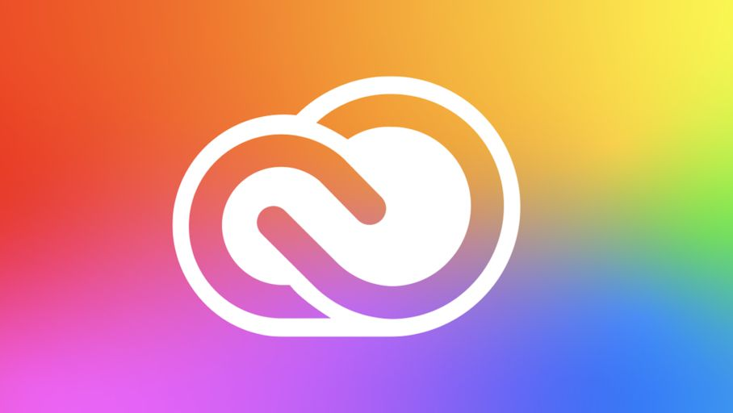
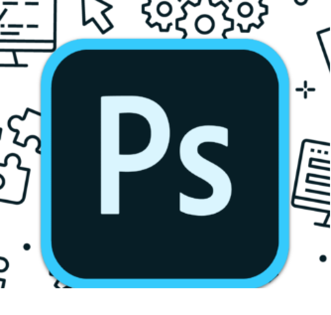

 
<Hero slots="image, heading, icon, text, buttons" variant="halfwidth" />

# Creativity for all

Creative Cloud services include tools and capabilities to streamline your workflows so that you, your team, and your stakeholders stay perfectly in sync across projects of any size 

* [Get started](https://adobe.io)
* [Sign up for the newsletter](https://adobe.io)

<AnnouncementBlock slots="heading, text, button" />

### Try out the magic of Photoshop

Pull together Photoshop, Lightroom and Adobe Sensei into one place. Reduce time spent in each app, freeing you up for more creative time.

[Demo](https://www.adobe.io/apis/creativecloud/photo-imaging-api/api-demo.html)

<TextBlock slots="image, heading, text1, text2, links" />

### Extend Adobe CC Flagship Apps

Extend Creative Cloud desktop apps like [Photoshop](https://www.adobe.com/products/photoshop.html), [Premiere Pro](https://www.adobe.com/products/premiere.html), and [InDesign](https://www.adobe.com/products/indesign.html) through our APIs and SDKs. 
Be sure to check out [Common Extensibility Platform (CEP)](https://www.adobe.io/apis/creativecloud/cep.html), which lets you build custom UI panels for multiple CC apps at once.

When you're ready to ship, distribute your work on [Adobe Exchange](https://exchange.adobe.com/), the preferred marketplace for Adobe Creative Cloud users. 
And be sure to join the [Exchange Program for Creative Cloud](https://partners.adobe.com/exchangeprogram/creativecloud) to unlock more benefits, including streamlined publishing and promotional opportunities.

*  [Adobe Premiere Pro](https://www.adobe.com/products/premiere.html)
*  [Adobe InDesign](https://www.adobe.com/products/indesign.html)
*  [Adobe After Effect](https://www.adobe.com/products/aftereffects.html)   

<TextBlock slots="heading, text, buttons, links, image"/>

### Start Building Adobe XD Plugins

Create plugins for Adobe XD that push the boundaries of experience design by adding new features to the app, automating workflows, connecting XD to external services, and more—all on a quick, modern JavaScript engine with native UI components. 
When you’re ready, you can ship your plugin to XD users right from within the app.

* [Get started](https://adobe.io)
* [Sign up for the newsletter](https://adobe.io)

- [No Icon Product](https://www.adobe.com/products/premiere.html)

<TitleBlock slots="heading, text" theme="light" />

### Collaborate better with Content Cloud APIs

With the Cloud Content APIs, you can bring design work created in XD directly to your product or service.

<TextBlock slots="image, heading, text, links" width="33%" theme="light" isCentered />

### Microsoft teams

Easily share Creative Cloud assets and files, and get comment notifications on your prototypes.

* [Learn more](https://www.microsoft.com/microsoft-365/microsoft-teams/group-chat-software)

<TextBlock slots="image, heading, text, links" width="33%" theme="light" isCentered />

### JIRA Cloud

Make designer to developer handoffs easy. Find the latest designs and specs and get thumbnail previews and asset info.

* [Learn more](https://www.atlassian.com/enterprise/cloud)

<TextBlock slots="image, heading, text, links" width="33%" theme="light" isCentered />

### Slack

Instantly share Creative Cloud files, designs, specs, and notifications all in real time.

* [Learn more](https://slack.com/enterprise)

<TextBlock slots="video, icons, heading, text, buttons" theme="dark" />

[Creative Cloud for a new era](https://www.youtube.com/watch?v=JemJbNJ4ZtU&ab_channel=AdobeCreativeCloud)

* 
* 

### Partner Success Story

Connect your users to Creative Cloud right from within your mobile or web apps with our service APIs. Give users access to 
world-class creative assets with the Adobe Stock API, or sign up for early information on our upcoming CC Storage API.

* [Learn more](https://adobe.io)
* [Sign up for partner program](https://adobe.io)

<TitleBlock slots="heading, text" />

### Blogs and resources

With the Cloud Content APIs, you can bring design work created in XD directly to your product or service.

<ResourceCard slots="link, image, heading, text" width="50%" variant="vertical" />

[Adobe I/O](https://adobe.io)

### Creating a Great Adobe XD Plugin Listing 

Rob Kleiman, July 8th 2020

<ResourceCard slots="link, image, heading, text" width="50%" />

[Adobe I/O](https://adobe.io)

### Pattern Builder: A Behind the Scenes Look at Adobe Capture

Nihil Gupta, July 24th 2020

<ResourceCard slots="link, image, heading, text" width="50%" />

[Adobe I/O](https://adobe.io)

### Photoshop Extensibility Enters a New Era Soon: How to get Involved Early

Ash Ryan Arnwine, March 12th 2020

<TitleBlock slots="heading" theme="light" />

## Get started building with Creative Cloud

<ProductCard slots="icon, heading, text, buttons" theme="light" width="33%" />

#### CC Storage API

CC Storage API lets you access and modify assets stored in the Creative Cloud, the world's most popular creative platform. 

* [Learn more](https://adobe.io)
* [View docs](https://adobe.io)

<ProductCard slots="heading, text, buttons" theme="light" width="33%" />

#### Adobe Stock

Gives your users access to the perfect Adobe Stock asset to enhance their creative projects. 

* [Learn more](https://adobe.io)
* [View docs](https://adobe.io)

<ProductCard slots="icon, heading, text, buttons" theme="light" width="33%" />

#### Common Extensibility Platform

Build extensions with HTML, CSS, Javascript and Node. Deploy across multiple Adobe apps. 

* [Learn more](https://adobe.io)
* [View docs](https://adobe.io)

<ProductCard slots="icon, heading, text, buttons" theme="light" width="33%" />

#### CC Storage API

CC Storage API lets you access and modify assets stored in the Creative Cloud, the world's most popular creative platform. 

* [Learn more](https://adobe.io)
* [View docs](https://adobe.io)

<ProductCard slots="heading, text, buttons" theme="light" width="33%" />

#### Adobe Stock

Gives your users access to the perfect Adobe Stock asset to enhance their creative projects. 

* [Learn more](https://adobe.io)
* [View docs](https://adobe.io)

<ProductCard slots="icon, heading, text, buttons" theme="light" width="33%" />

#### Common Extensibility Platform

Build extensions with HTML, CSS, Javascript and Node. Deploy across multiple Adobe apps. 

* [Learn more](https://adobe.io)
* [View docs](https://adobe.io)

<ProductCard slots="icon, heading, text, buttons" theme="light" width="33%" />

#### CC Storage API

CC Storage API lets you access and modify assets stored in the Creative Cloud, the world's most popular creative platform. 

* [Learn more](https://adobe.io)
* [View docs](https://adobe.io)

<ProductCard slots="heading, text, buttons" theme="light" width="33%" />

#### Adobe Stock

Gives your users access to the perfect Adobe Stock asset to enhance their creative projects. 

* [Learn more](https://adobe.io)
* [View docs](https://adobe.io)

<ProductCard slots="icon, heading, text, buttons" theme="light" width="33%" />

#### Common Extensibility Platform

Build extensions with HTML, CSS, Javascript and Node. Deploy across multiple Adobe apps. 

* [Learn more](https://adobe.io)
* [View docs](https://adobe.io)

<ProductCard slots="icon, heading, text, buttons" theme="light" width="33%" />

#### CC Storage API

CC Storage API lets you access and modify assets stored in the Creative Cloud, the world's most popular creative platform. 

* [Learn more](https://adobe.io)
* [View docs](https://adobe.io)

<ProductCard slots="heading, text, buttons" theme="light" width="33%" />

#### Adobe Stock

Gives your users access to the perfect Adobe Stock asset to enhance their creative projects. 

* [Learn more](https://adobe.io)
* [View docs](https://adobe.io)

<ProductCard slots="icon, heading, text, buttons" theme="light" width="33%" />

#### Common Extensibility Platform

Build extensions with HTML, CSS, Javascript and Node. Deploy across multiple Adobe apps. 

* [Learn more](https://adobe.io)
* [View docs](https://adobe.io)

<SummaryBlock slots="image, heading, text, buttons" background="rgb(246, 16, 27)" />

## Subscribe to the Creative Cloud developers newsletter 

A monthly newsletter featuring news for anyone who creates, develops, or build plugins, extensions, or integrations for the
Creative Cloud family of products.

* [Subscribe to the newsletter](https://adobe.io)
* [Learn more](https://adobe.io)