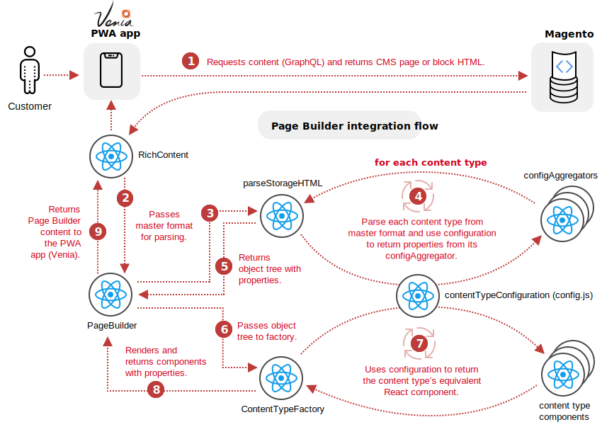

import Overview from '../transclusions/overview.md'
import AddAnalyticsIos from './add-analytics/ios.md'
import AddAnalyticsAndroid from './add-analytics/android.md'
import AddAnalyticsCordova from './add-analytics/cordova.md'
import AddAnalyticsFlutter from './add-analytics/flutter.md'
import AddAnalyticsUnity from './add-analytics/unity.md'
import AddAnalyticsReactNative from './add-analytics/react-native.md'
import AddAnalyticsXamarin from './add-analytics/xamarin.md'
import TeaserComp from './teaser/teasercomp.md'
import VideoCarouselComp from './videoCarousel/videoCarousel.md'
import blackbg from "./teaser/black_power.jpg"
import TextBlockComp from "./textblock/textblock.md"
import MiniResource from "./miniresource_block/index.md"

<Hero slots="image, heading, text" background="rgb(64, 34, 138)" hideBreadcrumbNav={false}/>

# Adobe Analytics

Adobe Product API offers limitless ways to integrate your most important customer data into key business processes. Adobe Product API offer limitless ways.

<Resources slots="heading, links"/>

#### Resources

* [Quickstart Guide](https://adobe.io?aio_internal)
* [Adobe Analytics Github Repo](https://github.com/AdobeDocs/analytics-2.0-apis)
* [Adobe InDesign](/AdobeInDesign.pdf)

<Overview />

## Discover

<DiscoverBlock slots="heading, link, text"/>

### Get Started

[Quickstart Guide](guides/index.md)

Get started with the Adobe Analytics APIs.

<DiscoverBlock slots="heading, link, text"/>

### Guides

[Calculated Metrics API](/src/pages/guides/Calculated%20Metrics%20API/index.md)

Returns information on the user's company that is necessary for making other Adobe Analytics API calls.

<DiscoverBlock slots="link, text"/>

[Segments API](guides/segments_api/)

Provides configuration guidance and best practices for the /segments endpoint.

<DiscoverBlock slots="link, text"/>

[Reporting Guide API](/apis/experiencecloud/analytics/docs#!AdobeDocs/analytics-2.0-apis/master/migration-guide.md)

Provides configuration guidance and best practices for the /reports endpoint.

<DiscoverBlock slots="link, text"/>

[Migrating from 1.4 to 2.0](guides/migrating/)

For help migrating from the 1.4 versions of the Analytics API to the newer and more capable /reports API.

<DiscoverBlock slots="heading, link, text"/>

### API References

[Try the API](api/)

Try the Analytics API with Swagger UI. Explore, make calls, with full endpoint descriptions.

## Contributing

We encourage you to participate in our open documentation initiative, if you have suggestions, corrections, additions
or deletions for this documentation, check out the source from [this github repo](https://github.com/AdobeDocs/dev-site-documentation-template), and submit a pull
request with your contribution. For more information, refer to the [contributing page][].

[contributing page]: /support/contribute

## API Requests & Rate Limits

The timeout for API requests through adobe.io is currently *60 seconds*.

The default rate limit for an Adobe Analytics Company is *120 requests per minute*. (The limit is enforced as *12 requests every 6 seconds*).
When rate limiting is being enforced you will get `429` HTTP response codes with the following response body: `{"error_code":"429050","message":"Too many requests"}`

## SVGs & Icons

<TeaserComp />

<TeaserBlock  slots="heading,text" textColor="white" position="right" bgURL={blackbg}/>

### TeaserBlock with image background

In TeaserBlock using bgURL={img}, we can load the backroundimage in the div and align the text position on the right by using position="right" attribute

<TeaserBlock  slots="heading,text" textColor="white" position="left" backgroundColor="rgb(64, 34, 138)" />

### TeaserBlock with background color

In TeaserBlock using bgURL={img}, we can load the backroundimage in the div and align the text position on the right by using position="left" attribute

## Accordion

Accordion has a group of accordion items used to collapse and expand the child content

### AccordionItem

Accordion item is to expand and collapse the content by clicking the icon. By default it uses `+` and `-` icon

<Accordion>

   <AccordionItem header="AccordionItemWithDefaultIcon">

   AccordionItem with default options to expand and collapse

   </AccordionItem>

   <AccordionItem header="AccordionItemWithChevron" isChevronIcon  position="right" iconColor="#1473E6">

   AccordionItem expand and collapse using ChevronIcon 

   </AccordionItem>

   <AccordionItem header="AccordionItemDefaultOpen" isOpen>

      AccordionItem default expand

   </AccordionItem>    

</Accordion>

<VideoCarouselComp />

<TextBlockComp />

<MiniResource />

## Inline Alerts {#Categories}

These are the five types of inline alerts you can use.

<InlineAlert slots="text"/>

This is the text that displays within the default alert variant — info.

<InlineAlert variant="neutral" slots="text" />

This is an inline alert with the variant `neutral`.

<InlineAlert variant="info" slots="text" />

This is an inline alert with the variant `info`.

<InlineAlert variant="help" slots="text" />

This is an inline alert with the variant `help`.

<InlineAlert variant="success" slots="text" />

This is an inline alert with the variant `success`.

<InlineAlert variant="warning" slots="text" />

This is an inline alert with the variant `warning`.

<InlineAlert variant="error" slots="text" />

This is an inline alert with the variant `error`.

<InlineAlert variant="success" slots="header, text" />

InlineAlert components can have header text.

And InlineAlert components can have body text like this. InlineAlert components can have body text like this.InlineAlert components can have body text like this.InlineAlert components can have body text like this.InlineAlert components can have body text like this.InlineAlert components can have body text like this.

<InlineAlert variant="help" slots="header, text1, text2, text3, text4" />

Multiple paragraphs!!

The number of paragraphs is technically unlimited for flexibility.

But you know the drill. *Discretion is key.*

This is your **third paragraph**.

This is your ~~last~~ fourth paragraph. You can make each paragraph as long as you want.
As long as you don't create an empty line in between your text blocks.

<InlineAlert variant="warning" slots="header, text-10, text-1, text-doesnt-matter-just-start-with-text-and-make-it-unique" />

Important "text slot" details

This is the first text slot, but its slot name is `text-10`.

This is the second text slot, but its slot name is `text-1`.

So the only requirements for naming your text slots — **only within the InlineAlert component for now** — is to start
them with `text` and make them unique from the other text slots in the alert. For example, this is a valid slot
name: `text-doesnt-matter-just-start-with-text-and-make-it-unique`.

<InlineAlert variant="help" slots="header, text1, text2, text3, text4" />

Alternative steps:

**Step 1:** This is faux step text for the `text1` slot. This is faux step text for the `text1` slot. This is faux step
text for the `text1` slot. This is faux step text for the `text1` slot. This is faux step text for the `text1` slot.

**Step 2:** This is faux step text for the `text2` slot. This is faux step text for the `text2` slot. This is faux step
text for the `text2` slot.

**Step 3:** This is faux step text for the `text3` slot.

**Step 4:** This is faux step text for the `text4` slot. This is faux step text for the `text3` slot.

<InlineAlert variant="error" slots="header, text, text2, text1" />

This is an error!

This is an inline alert with the variant `error`. This is an inline alert with the variant `error`. This is an inline alert with the variant `error`. This is an inline alert with the variant `error`. This is an inline alert with the variant `error`. This is an inline alert with the variant `error`.

**This is currently the best way to add a code block to an InlineAlert:**

`warn Warning: Event "xstate.after(200)#waitingMachine.aggregatingFileChanges" was sent to stopped service "waitingMachine". This service has already reached its final state, and will not transition.
Event: {"type":"xstate.after(200)#waitingMachine.aggregatingFileChanges"}`

## Inline Code {#Sweet_inline-CODE}

This is an example of `inline code` written with the standard markdown backticks.

## Tables {#Kick-Ass-Tables}

Some tables here for testing.

| | |
|-----------------|----------------------------|
| **Class name:** | `InstallSchema`            |
| **Interface:**  | [`InstallSchemaInterface`] |
| **Method:**     | `install()`                |

| |
|:----------------:|
| **Class name:** |
| **Interface:**  |
| **Method:**     |

Here's a table with some column headers and bigger rows.

Element | Description
--- | ---
`name` | A fully-qualified component name, in the format `<vendor-name>/<component-name>`. All letters must be in lowercase. Use dashes in the `<component-name>` to separate words. Themes must use the format `<vendor-name>/theme-<area>-<theme-name>`.
`type` | For modules, this value must be set to `magento2-module`. Other possible types are `metapackage`, `magento2-theme`, and `magento2-language`.
`autoload` | Specify necessary information to be loaded, such as [registration.php](../build/component-registration.md). For more information, see [Autoloading](https://getcomposer.org/doc/01-basic-usage.md#autoloading) from Composer.

Inline Alert as a nested component

1. Under _Personal Information_, enter your **First Name**, **Last Name**, **Email Address**, and **Country**.

   <InlineNestedAlert variant="info" header="true" iconPosition="right">

   Personal Information :

   Lorem ipsum dolor sit amee

   Add more information

   Lorem ipsum dolor sit amet

   </InlineNestedAlert>

   Lorem ipsum dolor sit amet

2. Under _My Company Primarily_, choose the best description of your company's primary focus. Then, set **My Role** to the option that best describes what you do for the company.

   <InlineNestedAlert variant="info" header="true" iconPosition="left">

      Level2 :

      Lorem ipsum dolor sit amee

      Level 2 information

      Lorem ipsum dolor sit amet

   </InlineNestedAlert>

   1. SubLevel 1

      Subcontain

      <InlineNestedAlert variant="error" header="true" iconPosition="left">

      Sublevel1 :

      Lorem ipsum dolor sit amee

      Sub Level 1 information

      Lorem ipsum dolor sit amet

      </InlineNestedAlert>
   